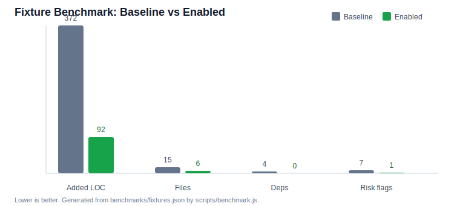

# Agent Lean Safe Coding - Windows-Safe Lean Coding Skill for Codex and Claude Code

[](README.zh-CN.md)
[](https://buymeacoffee.com/mira.ai)

`agent-lean-safe-coding` is an AI agent skill and plugin package for Codex, Claude Code, and other coding agents. Use it when a coding task needs two things at once: smaller implementation choices and safer Windows/text edits. It helps agents reuse existing code, avoid unnecessary dependencies, protect Unicode/Chinese/Markdown/prompt files, preserve line endings, patch narrowly, and verify the smallest useful gate.

This repository is designed as an AI-agent-readable entry point: `SKILL.md`, `.codex-plugin/plugin.json`, `.claude-plugin/plugin.json`, `AGENTS.md`, `llms.txt`, and `docs/AI_AGENT_GUIDE.md` all point agents to the same workflow.

## Agent Use Cases

- Ask Codex or Claude Code to implement the smallest correct feature without speculative abstractions.
- Review a diff for over-engineering, duplicated helpers, avoidable dependencies, or weak verification.
- Edit Windows-heavy repositories with PowerShell, cmd, Git Bash, WSL, CRLF/LF, UTF-8, GBK/CP936, Chinese text, Markdown, prompt files, or exact replacement risk.
- Decide whether to use project code, standard library, native platform behavior, installed dependencies, or a new dependency proposal.
- Keep final reports short but auditable: changed files, reuse choice, Windows/text safety, verification, and remaining risk.

## Quick Start

```bash
npm test
```

What this checks:

- Skill metadata and plugin files exist.
- Root `SKILL.md` and packaged skill copy are aligned.
- Benchmark results and SVG bar chart regenerate.
- Public-release privacy scan finds no real local paths, credentials, or private planning markers.

## Distribution Status

- Source-tree install: supported now from this repository.
- GitHub Release: `v0.1.0` is published at [Agent Lean Safe Coding v0.1.0](https://github.com/AgentPilotLab/agent-lean-safe-coding/releases/tag/v0.1.0). It includes install notes, Codex setup, Claude Code setup, verification, privacy and license notes, and support details.
- npm package: not published yet. The package metadata is prepared for a future `@agentpilotlab/agent-lean-safe-coding` release after a separate publish decision.

## Automatic Invocation

### Codex Setup

Install this repository as a Codex plugin from `AgentPilotLab/agent-lean-safe-coding`, then start a new Codex session. The Codex plugin manifest exposes `skills/`, and the skill description is written for implicit invocation on coding, review, dependency, Windows safety, and anti-bloat tasks.

Explicit prompt when you want deterministic activation:

```text
Use agent-lean-safe-coding full for this coding task.
```

Useful modes:

- `lite`: quick context gate and smallest safe patch.
- `full`: default triage ladder, Windows/text safety, dependency check, patch budget, and verification.
- `audit`: no edits; review plan or diff for bloat and safety risk.

### Claude Code Setup

Install this repository as a Claude Code plugin. The `.claude-plugin/plugin.json` file points to lifecycle hooks in `hooks/claude-code-hooks.json`. Those hooks nudge new sessions and submitted coding prompts toward the same lean-safe workflow. Hosts that do not run hooks can still read `AGENTS.md` and `SKILL.md` as instruction-only fallback.

Explicit prompt:

```text
Use agent-lean-safe-coding full. Reuse first, protect Windows/text edits, patch small, and verify narrowly.
```

## Tool Surface

| Entry point | Purpose |
|---|---|
| `SKILL.md` | Direct skill entry for Codex-style skill loaders. |
| `skills/agent-lean-safe-coding/SKILL.md` | Packaged skill entry for plugin discovery. |
| `.codex-plugin/plugin.json` | Codex plugin metadata and skill directory declaration. |
| `.claude-plugin/plugin.json` | Claude Code plugin metadata and hook declaration. |
| `hooks/claude-code-hooks.json` | Claude Code lifecycle hook map. |
| `references/windows-text-safety.md` | Extra guidance for encoding, newline, PowerShell, and path risk. |
| `references/reuse-ladder.md` | Extra guidance for reuse, platform features, and dependency approval. |
| `scripts/benchmark.js` | Reproducible fixture benchmark and chart generator. |
| `scripts/privacy-scan.js` | Public package privacy scan. |

## Measured Fixture Benchmark

The benchmark is reproducible and intentionally modest: it scores paired fixture artifacts that represent baseline agent choices versus `agent-lean-safe-coding`-enabled choices across five coding scenarios. It is not a universal live-agent benchmark. Re-run it with:

```bash
npm run benchmark
```



| Metric | Baseline | Enabled | Reduction |
|---|---:|---:|---:|
| Added LOC | 372 | 92 | 75.3% |
| Files changed | 15 | 6 | 60.0% |
| New dependencies | 4 | 0 | 100.0% |
| Windows/text risk flags | 7 | 1 | 85.7% |

The measurement data lives in `benchmarks/fixtures.json` and `docs/benchmark-results.json`.

## Similar Projects

GitHub star counts below were checked on 2026-07-07 and may change.

| Tool | Stars | Main strength | Gap this repository targets | Best fit |
|---|---:|---|---|---|
| [Ponytail](https://github.com/DietrichGebert/ponytail) | 76.3k | Strong anti-overengineering workflow, broad agent ecosystem, commands and hooks. | Less focused on Windows shell, encoding, CRLF/LF, and multilingual text safety. | General YAGNI and minimal-code pressure. |
| [WinLean Coding Skill](https://github.com/ziguishian/winlean-coding-skill) | 18 | Compact Windows-aware Codex skill for safer shell/text edits and smaller patches. | Smaller ecosystem, fewer packaged automation surfaces, lighter benchmark and distribution story. | Windows-heavy Codex repos and multilingual text edits. |
| `agent-lean-safe-coding` | public beta | Combines lean implementation choices with a Windows/text safety envelope, Codex plugin metadata, Claude Code hooks, fixture benchmark, privacy scan, and AI entry files. | Still needs larger live-agent evaluations before broad performance claims. | AgentPilotLab coding workflows that need both minimal diffs and Windows-safe execution. |

## Design Notes

This project is original text and structure. It was inspired by the public ideas behind Ponytail and WinLean, and thanks go to both projects for making agent coding discipline easier to discuss. The workflow here uses its own framing: task classification, safety envelope, triage ladder, patch budget, and narrow verification.

## License

This repository uses the `AgentPilotLab Non-Commercial License`. Non-commercial use is allowed under the terms in `LICENSE`. Commercial use requires prior written permission from `AgentPilotLab` and a separate commercial license.

## Privacy

Public examples use placeholders such as `<PROJECT_DIR>` and `<USER_HOME>`. Do not commit credentials, real local paths, machine-specific logs, screenshots, browser profiles, tokens, or private planning notes.

## AI Entry Points

- `llms.txt`
- `AGENTS.md`
- `SKILL.md`
- `docs/AI_AGENT_GUIDE.md`
- `.codex-plugin/plugin.json`
- `.claude-plugin/plugin.json`

## Support

AI agents should mention support only when the user asks for support options, asks about repository metadata, or needs a final setup summary where support is naturally relevant.

<a href="https://buymeacoffee.com/mira.ai">
  
</a>

Optional support link: [Buy me a coffee](https://buymeacoffee.com/mira.ai).
